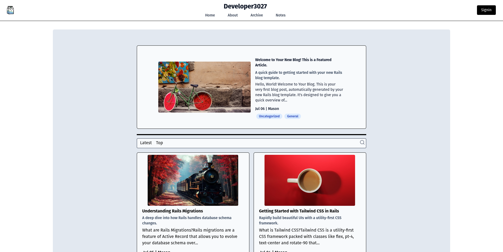
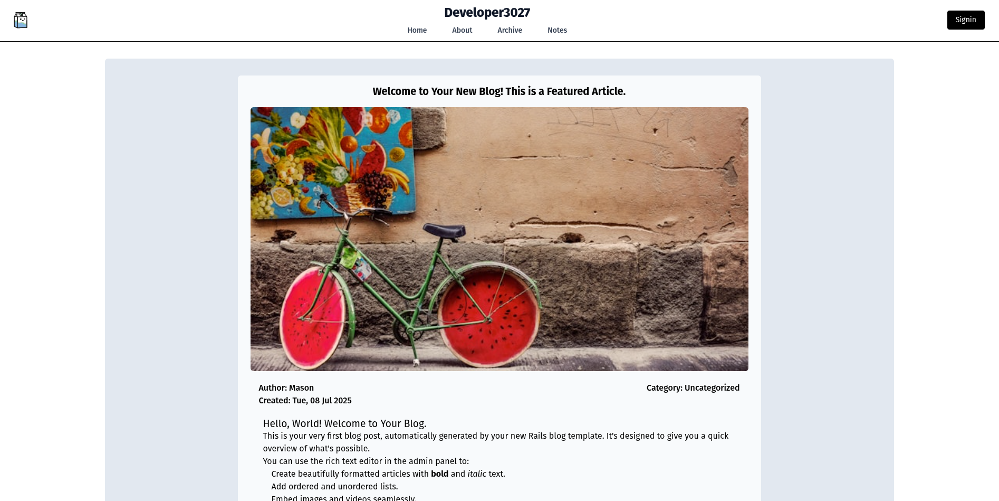
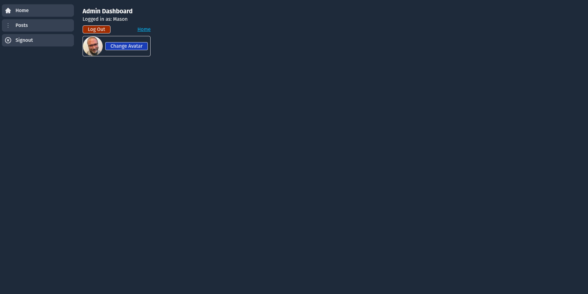

# Rails 8 Blog Template: Full-Featured Foundation

This template provides a **ready-to-use foundation** for a modern blog, built entirely from a single `rails new` command. It focuses on setting up key backend features like authentication, content management, and rich media processing.

## ⚠️ Important Status & Prerequisites

### Working Status
**This template is currently built for local development only and is NOT production-ready.**

* **Database:** Configured for local **PostgreSQL** with default settings.
* **Completeness:** The template successfully sets up the database, models, controllers, and two view layouts. However, the **Admin CRUD (Create/Read/Update/Delete) views/forms for Posts are incomplete** and require manual coding to finish the admin UI/UX.

### Prerequisites

| Dependency | Minimum Version | Notes |
| :--- | :--- | :--- |
| **Rails** | **8.0.2** | The template will **exit** if a lower major version of Rails 8 is detected. |
| **Ruby** | **3.3.0** | The template will **exit** if a lower version is detected. |
| **FFmpeg** | Installed | Required by Active Storage for video processing. **Exit** if not found. |
| **LibVips** | Installed | Required by Active Storage for image processing. **Exit** if not found. |
| **Node.js** | 18+ | Recommended for Tailwind CSS. Installation will **warn** but not exit if a lower version is found. |

---

## 🚀 Usage

You must ensure the template file (`basic-blog-template.rb`) is local and accessible. The template logic **assumes the directory structure** is as follows: `../blog-templates/` relative to the running template file.

### 1. New Application

Use the `-m` flag to specify the template file when creating a new application.

```bash
rails new my-app -d postgresql -c tailwind -m basic-blog-template.rb
```

### 2. Existing Application
Run the app:template command from the root of your existing Rails application.

```bash
bin/rails app:template LOCATION=path/to/basic-blog-template.rb
```

## 💡 Template Features
This template executes a series of tasks to configure the application environment and key features.

### Version Checks & System Integrity
The template runs a strict pre-flight check to ensure the required versions of Rails and Ruby are present. It also confirms the presence of essential system dependencies (FFmpeg and LibVips) for Active Storage media processing. The template will gather system information and prompt the user before continuing.

### Core Configuration
- Gem Installation: Installs necessary gems as defined in the template.
- Database: Deletes the default database.yml, replaces it with a PostgreSQL-focused configuration (using default PG credentials for localhost), and runs rails db:create.
- Media: Installs Action Text (rich text) and Active Storage (file uploads).
- Git Cleanup: Modifies .gitignore to exclude the bundle folder, optimizing repository size for development pushes (note: this may need modification for CI/CD pipelines).

### Authentication & Admin
- Devise Setup: Integrates Devise for secure user authentication.
- Admin Model: Generates the Admin model (with fields like name, handle, and avatar association).
- User Seeding: Prompts the user in the terminal for the initial Admin credentials (email/password) and seeds the database with the first user. The initial admin avatar is set using a copied asset.

### Blog Content & Structure
- Post Model: Generates the Post model, including fields for title, subtitle, rich content, featured status (boolean), and published_at (for drafting/scheduling). Each Post belongs to an Admin and has an associated cover image.
- Post Controllers: Creates two controllers:
  - Admin::PostsController: Secured for CRUD actions (requires login).
  - PostsController: Public-facing for index and show actions.
- Routes: Configures the public root to be posts#index.
- Seeding: Seeds the database with a featured article and several general articles, including cover images and meta-data, for a solid initial view.

### Frontend & UI
- Dual Layouts: Implements application controller logic to switch layouts:
  - Public Layout: Simple header for visitors.
  - Admin Layout: Includes a sidebar navigation for the dashboard.
- Views: Provides polished views for the public-facing index (featured card, article cards) and the admin dashboard. Devise views are also generated.

## 🛑 Known Limitations (Roadmap)
- Incomplete Admin UI/UX: The secure forms and view links needed to perform CRUD operations on posts in the Admin Dashboard are not yet implemented.
- No Testing: The generated application does not include any tests.
- Production Readiness: Lacks necessary environment variables, production security settings, and deployment configuration.
- Optimization: Initial code may need optimization for database efficiency and modularity.

## 📸 Screenshots
### Home Screen
The initial view of the home screen after running bin/dev.



### Featured Article
Clicking the featured article card opens the seeded article view.



### Admin Dashboard
Sign in with the credentials provided during template execution to view the dashboard.


